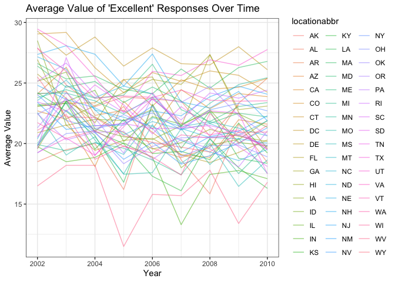

P8105_hw3_my2838
================

# Problem 1

``` r
aisle = pull(instacart, aisle) 
# number of aisle
unique (aisle) |>
  length ()
```

    ## [1] 134

``` r
# find the item most ordered
freq = table(aisle) 
names(freq)[which.max(freq)]
```

    ## [1] "fresh vegetables"

``` r
aisle_df = as.data.frame (freq)
colnames(aisle_df) = c("aisle","freq")

aisle_df |>
  subset( freq > 10000) |>
  ggplot(aes(x = aisle, y = freq)) +
  geom_bar(stat = "identity", fill = "skyblue", color = "black") +
  theme(axis.text.x = element_text(angle = 90, hjust = 0.5, vjust = 0.5))
```

<!-- -->

``` r
result_df =
  instacart |>
  filter(aisle == "baking ingredients" | aisle == "dog food care" | aisle == "packaged vegetables fruits") |>
  group_by(aisle) |>
  count(product_name) |>
  mutate(rank = min_rank(desc(n))) |>
  filter(rank < 4) |>
  arrange(aisle, rank) |>
  rename(times = n) |>
  knitr::kable()
```

``` r
result2_df = 
  instacart |>
  filter(product_name == "Pink Lady Apples"| product_name == "Coffee Ice Cream") |>
  group_by(product_name, order_dow) |>
  summarize(mean_hours = mean(order_hour_of_day), .groups = "drop") |>
  mutate( order_dow = factor(order_dow,
                             labels = c("Sun","Mon","Tue","Wed","Thu","Fri","Sat"))) |>
  pivot_wider(
    names_from = order_dow, 
    values_from = mean_hours) |>
  knitr::kable()
```

# Problem 2

``` r
library(p8105.datasets)
data("brfss_smart2010") 

# Data Cleaning
brfss = 
  brfss_smart2010 |>
  janitor::clean_names()  |>
  filter(
  topic == "Overall Health", 
  response %in% c("Excellent", "Very good", "Good", "Fair", "Poor")
  ) |>
  mutate(
    response = factor(response, levels = c("Poor", "Fair", "Good", "Very good", "Excellent"))
  )
```

``` r
states =
  brfss |>
  group_by(year, locationabbr) |>
  summarise(locations_count = n_distinct(locationdesc), .groups = "drop") |>
  filter(locations_count >= 7)|>
  filter( year == 2002 | year == 2010) |>
  group_by(year) |>
  mutate(rank = min_rank(desc(locations_count))) |>
  arrange(year, rank)
```

``` r
  brfss |>
  filter(response == "Excellent") |>
  group_by(year, locationabbr) |>
  summarise(average_value = mean(data_value, na.rm = TRUE), .groups = "drop") |>
  ggplot( aes(x = year, y = average_value, group = locationabbr, color = locationabbr)) +
  geom_line(alpha = .5)  +
  labs(title = "Average Value of 'Excellent' Responses Over Time", 
       x = "Year", y = "Average Value") +
  theme_bw()
```

<!-- -->

``` r
  brfss |>
  filter(locationabbr == "NY", year == 2006 | year == 2010) |>
  ggplot( aes(x = response, y = data_value, fill = response)) +
  geom_boxplot() +
  facet_grid(. ~ year) +
  labs(
    title = "Distribution of data_value for Responses in NY",
    x = "Response",
    y = "Data Value"
  ) +
  theme_bw() +
  theme(axis.text.x = element_text(angle = 90, hjust = 0.5, vjust = 0.5))
```

<!-- -->
