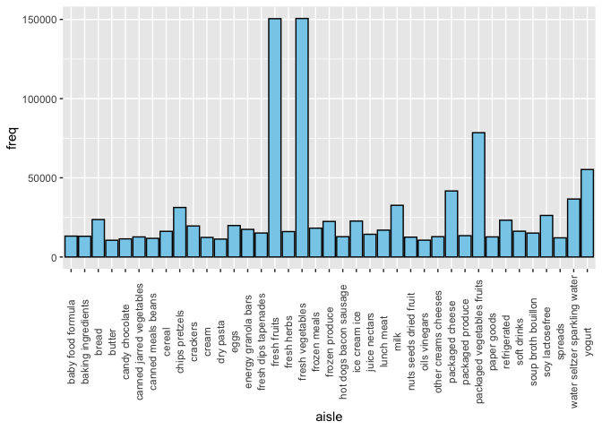
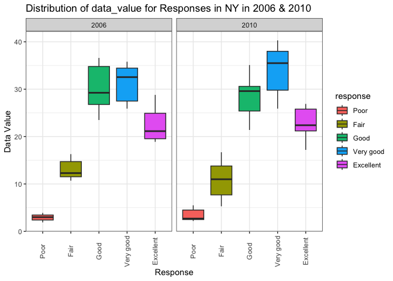
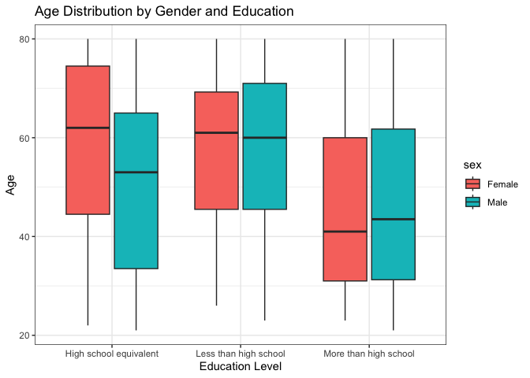
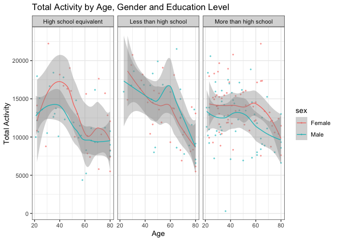

P8105_hw3_my2838
================

# Problem 1

*How many aisles are there, and which aisles are the most items ordered
from?*

``` r
aisle = pull(instacart, aisle) 
# number of aisle
unique (aisle) |>
  length ()
```

    ## [1] 134

``` r
# find the item most ordered
freq = table(aisle) 
names(freq)[which.max(freq)]
```

    ## [1] "fresh vegetables"

There are 134 aisles, and the most items ordered is **fresh
vegetables**.

*Make a plot that shows the number of items ordered in each aisle,
limiting this to aisles with more than 10000 items ordered. Arrange
aisles sensibly, and organize your plot so others can read it.*

``` r
aisle_df = as.data.frame (freq)
colnames(aisle_df) = c("aisle","freq")

aisle_df |>
  subset( freq > 10000) |>
  ggplot(aes(x = aisle, y = freq)) +
  geom_bar(stat = "identity", fill = "skyblue", color = "black") +
  theme(axis.text.x = element_text(angle = 90, hjust = 0.5, vjust = 0.5))
```

<!-- -->

*Make a table showing the three most popular items in each of the aisles
“baking ingredients”, “dog food care”, and “packaged vegetables fruits”.
Include the number of times each item is ordered in your table.*

``` r
instacart |>
  filter(aisle == "baking ingredients" | aisle == "dog food care" | aisle == "packaged vegetables fruits") |>
  group_by(aisle) |>
  count(product_name) |>
  mutate(rank = min_rank(desc(n))) |>
  filter(rank < 4) |>
  arrange(aisle, rank) |>
  rename(times = n) |>
  knitr::kable()
```

| aisle                      | product_name                                  | times | rank |
|:---------------------------|:----------------------------------------------|------:|-----:|
| baking ingredients         | Light Brown Sugar                             |   499 |    1 |
| baking ingredients         | Pure Baking Soda                              |   387 |    2 |
| baking ingredients         | Cane Sugar                                    |   336 |    3 |
| dog food care              | Snack Sticks Chicken & Rice Recipe Dog Treats |    30 |    1 |
| dog food care              | Organix Chicken & Brown Rice Recipe           |    28 |    2 |
| dog food care              | Small Dog Biscuits                            |    26 |    3 |
| packaged vegetables fruits | Organic Baby Spinach                          |  9784 |    1 |
| packaged vegetables fruits | Organic Raspberries                           |  5546 |    2 |
| packaged vegetables fruits | Organic Blueberries                           |  4966 |    3 |

*Make a table showing the mean hour of the day at which Pink Lady Apples
and Coffee Ice Cream are ordered on each day of the week; format this
table for human readers (i.e. produce a 2 x 7 table).*

``` r
instacart |>
  filter(product_name == "Pink Lady Apples"| product_name == "Coffee Ice Cream") |>
  group_by(product_name, order_dow) |>
  summarize(mean_hours = mean(order_hour_of_day), .groups = "drop") |>
  mutate( order_dow = factor(order_dow,
                             labels = c("Sun","Mon","Tue","Wed","Thu","Fri","Sat"))) |>
  pivot_wider(
    names_from = order_dow, 
    values_from = mean_hours) |>
  knitr::kable()
```

| product_name     |      Sun |      Mon |      Tue |      Wed |      Thu |      Fri |      Sat |
|:-----------------|---------:|---------:|---------:|---------:|---------:|---------:|---------:|
| Coffee Ice Cream | 13.77419 | 14.31579 | 15.38095 | 15.31818 | 15.21739 | 12.26316 | 13.83333 |
| Pink Lady Apples | 13.44118 | 11.36000 | 11.70213 | 14.25000 | 11.55172 | 12.78431 | 11.93750 |

# Problem 2

First, do some data cleaning.

``` r
library(p8105.datasets)
data("brfss_smart2010") 

# Data Cleaning
brfss = 
  brfss_smart2010 |>
  janitor::clean_names()  |>
  filter(
  topic == "Overall Health", 
  response %in% c("Excellent", "Very good", "Good", "Fair", "Poor")
  ) |>
  mutate(
    response = factor(response, levels = c("Poor", "Fair", "Good", "Very good", "Excellent"))
  )
```

*In 2002, which states were observed at 7 or more locations? What about
in 2010?*

``` r
  brfss |>
  group_by(year, locationabbr) |>
  summarise(count = n_distinct(locationdesc), .groups = "drop") |>
  filter(count >= 7)|>
  filter( year == 2002 | year == 2010) |>
  group_by(year) |>
  mutate(rank = min_rank(desc(count))) |>
  rename(state = locationabbr ) |>
  arrange(year, rank) |>
  knitr::kable()
```

| year | state | count | rank |
|-----:|:------|------:|-----:|
| 2002 | PA    |    10 |    1 |
| 2002 | MA    |     8 |    2 |
| 2002 | NJ    |     8 |    2 |
| 2002 | CT    |     7 |    4 |
| 2002 | FL    |     7 |    4 |
| 2002 | NC    |     7 |    4 |
| 2010 | FL    |    41 |    1 |
| 2010 | NJ    |    19 |    2 |
| 2010 | TX    |    16 |    3 |
| 2010 | CA    |    12 |    4 |
| 2010 | MD    |    12 |    4 |
| 2010 | NC    |    12 |    4 |
| 2010 | NE    |    10 |    7 |
| 2010 | WA    |    10 |    7 |
| 2010 | MA    |     9 |    9 |
| 2010 | NY    |     9 |    9 |
| 2010 | OH    |     8 |   11 |
| 2010 | CO    |     7 |   12 |
| 2010 | PA    |     7 |   12 |
| 2010 | SC    |     7 |   12 |

In 2002, PA, MA, NJ, CT, FL, NC were observed at 7 or more locations. In
2010, FL, NJ, TX, CA, MD, NC, NE, WA, MA, NY, OH, CO, PA, SC were
observed at 7 or more locations.

*Construct a dataset that is limited to Excellent responses, and
contains, year, state, and a variable that averages the data_value
across locations within a state. Make a “spaghetti” plot of this average
value over time within a state (that is, make a plot showing a line for
each state across years – the geom_line geometry and group aesthetic
will help).*

``` r
  brfss |>
  filter(response == "Excellent") |>
  group_by(year, locationabbr) |>
  summarise(average_value = mean(data_value, na.rm = TRUE), .groups = "drop") |>
  ggplot( aes(x = year, y = average_value, group = locationabbr, color = locationabbr)) +
  geom_line(alpha = .5)  +
  labs(title = "Average Value of 'Excellent' Responses Over Time", 
       x = "Year", y = "Average Value") +
  theme_bw()
```

<!-- -->

*Make a two-panel plot showing, for the years 2006, and 2010,
distribution of data_value for responses (“Poor” to “Excellent”) among
locations in NY State.*

``` r
  brfss |>
  filter(locationabbr == "NY", year == 2006 | year == 2010) |>
  ggplot( aes(x = response, y = data_value, fill = response)) +
  geom_boxplot() +
  facet_grid(. ~ year) +
  labs(
    title = "Distribution of data_value for Responses in NY in 2006 & 2010",
    x = "Response",
    y = "Data Value"
  ) +
  theme_bw() +
  theme(axis.text.x = element_text(angle = 90, hjust = 0.5, vjust = 0.5))
```

<!-- -->

# Problem 3

Load, tidy, merge, and otherwise organize the data sets.

``` r
covar =
  read_csv("data/nhanes_covar.csv", skip = 4, show_col_types = FALSE) |>
  janitor::clean_names() |>
  filter(age >= 21) |>
  drop_na() |>
  mutate(education = case_when(
    education == 1 ~ "Less than high school",
    education == 2 ~ "High school equivalent",
    education == 3 ~ "More than high school"
  ),
  sex = case_when(
    sex == 1 ~ "Male",
    sex == 2 ~ "Female"
  ))
```

Produce a reader-friendly table for the number of men and women in each
education category.

``` r
covar |>
  group_by (sex, education) |>
  summarize(count = n(), .groups = "drop") |>
  pivot_wider(
    names_from = sex,
    values_from = count
  ) |>
  knitr::kable()
```

| education              | Female | Male |
|:-----------------------|-------:|-----:|
| High school equivalent |     23 |   35 |
| Less than high school  |     28 |   27 |
| More than high school  |     59 |   56 |

Create a visualization of the age distributions for men and women in
each education category.

``` r
#Visualization of Age Distribution
ggplot(covar, aes(x = education, y = age, fill = sex)) +
  geom_boxplot() +
  labs(title = "Age Distribution by Gender and Education",
       x = "Education Level",
       y = "Age") +
  theme_bw() 
```

<!-- -->

**Comments:** From the table, there are far more participants with a
high school education than any other education. The participants with
high school equivalent are more males than females, but for the other
education level the numbers of participants of both genders are equal.

From the boxplot, participants with more than high school degree are
younger. Specifically, females participants were older than males among
participants with a high school equivalent, while males and females were
about the similar age among other levels.

Using the tidied dataset, aggregate across minutes to create a total
activity variable for each participant.

``` r
accel =
  read_csv("data/nhanes_accel.csv", show_col_types = FALSE) |>
  janitor::clean_names() 
accel = 
  mutate(accel, activity = rowSums(accel[, -1])) |>
  select(seqn, activity, everything())

nhanes = inner_join(covar, accel, by = "seqn")
```

Plot these total activities (y-axis) against age (x-axis), compare men
to women and have separate panels for each education level.

``` r
ggplot(nhanes, aes(x = age, y = activity, color = sex)) +
  geom_point(alpha = .5, size = .5) +
  geom_smooth(linewidth = .5) +
  facet_wrap(. ~education) +
  labs(title = "Total Activity by Age, Gender and Education Level", x = "Age", y = "Total Activity") +
  theme_bw()
```

    ## `geom_smooth()` using method = 'loess' and formula = 'y ~ x'

<!-- -->

**Comments:** There is a correlation between age and activity, where the
older the people are (around 60 years old), the less active they are.
But there is no direct relationship between the education level and
activity. Overall, we can assume that the female participants are more
active than male.

Make a three-panel plot that shows the 24-hour activity time courses for
each education level and use color to indicate sex.

``` r
mean_act = 
  nhanes |>
  group_by (education, sex) |>
  summarise(across(starts_with("min"), ~ mean(.), .names = "mean_{.col}"), .groups = "drop") |>
  pivot_longer(cols = starts_with("mean_"), names_to = "time", values_to = "mean")|>
  mutate(
    time = substring(time, 9),
    time = as.numeric(time)
  )

ggplot(mean_act, aes(x = time/60 , y = mean, color = sex)) +
  geom_line(linewidth = .5, alpha = .5) +
  geom_smooth(method = "gam", linewidth = .5) +
  facet_grid(. ~education) +
  labs(title = "Activity by Education Level and Gender in 24 hours", 
       x = "Time(in hours)",
       y = "Mean Activity") +
  theme_bw()
```

    ## `geom_smooth()` using formula = 'y ~ s(x, bs = "cs")'

<!-- -->

**Comments:** Generally, the female participants are more active than
male though the whole day.All participants were least active at 5 and
most active during the day (10-20) compared to the night times.
